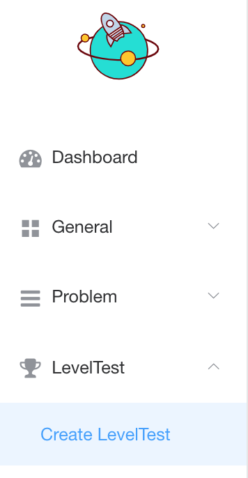
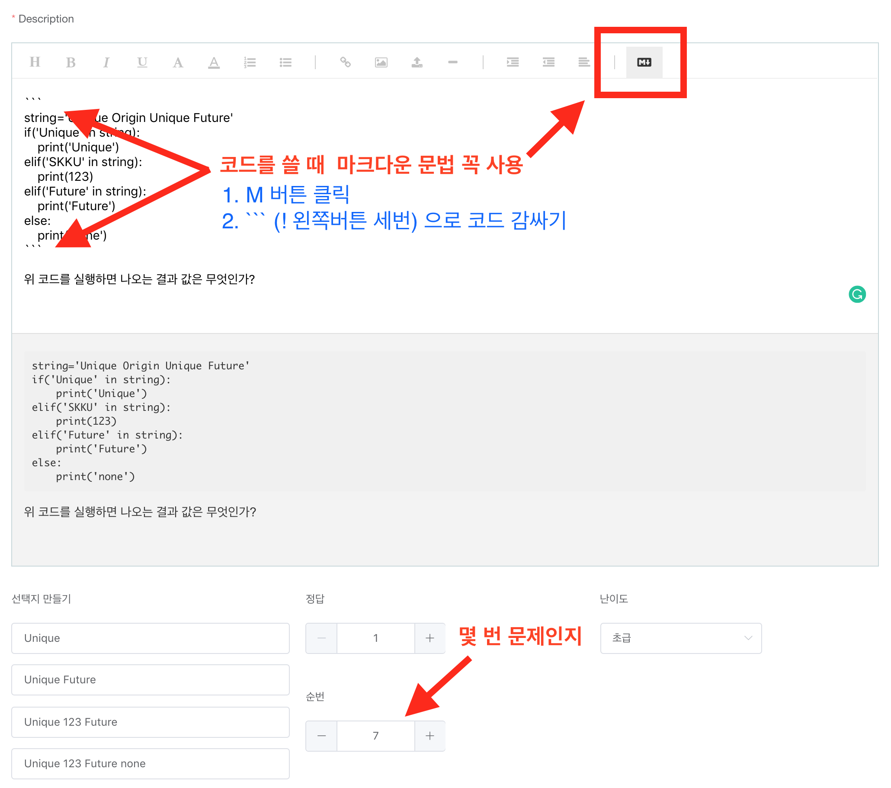

# Qurious Frontend


## Admin Management

1. Admin계정으로 로그인을 한다.
2. 화면 우측 상단의 계정명을 클릭한다
3. 드롭다운 메뉴중 Management를 클릭한다.

### Level Test Problem



- Level Test -> Create Level Test로 이동



- 위와 같이 입력란을 채운다.
- 코드 관련 부분은 꼭 마크다운 적용 후 코드블록(```)으로 감싸준다.
- 코드 인덴트는 tab이 먹히지 않는 관계로 띄어쓰기 4번을 인덴트 한번으로 한다.
